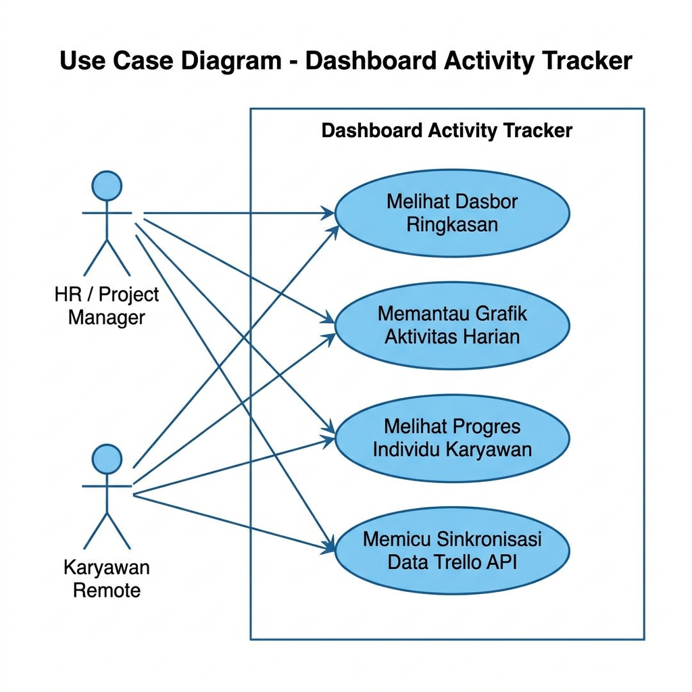
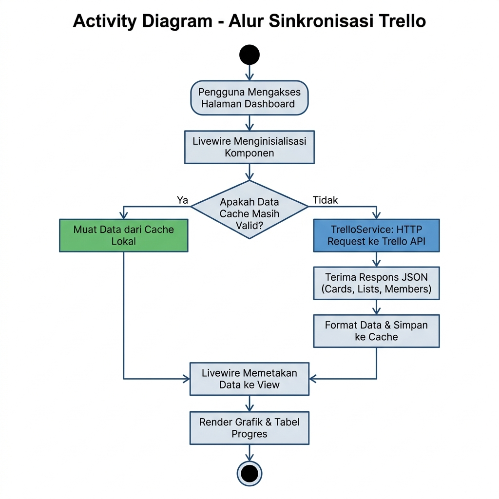
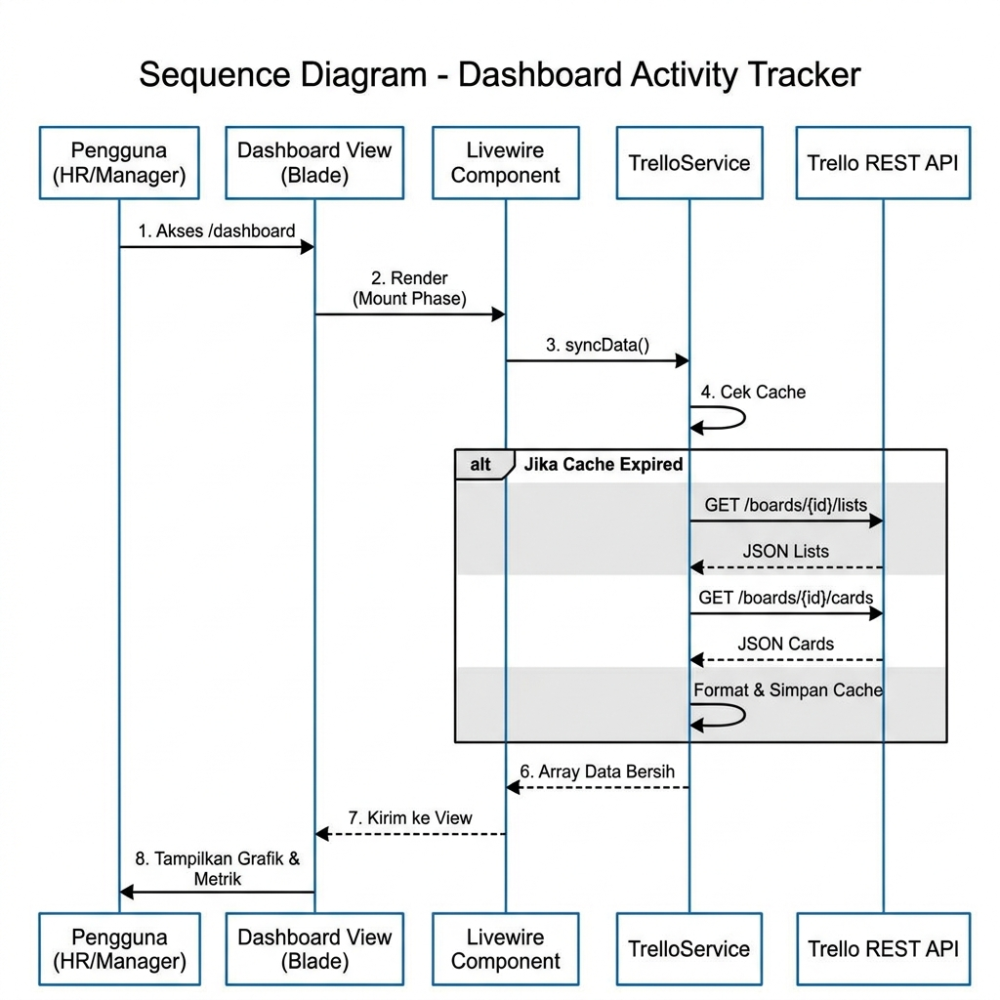
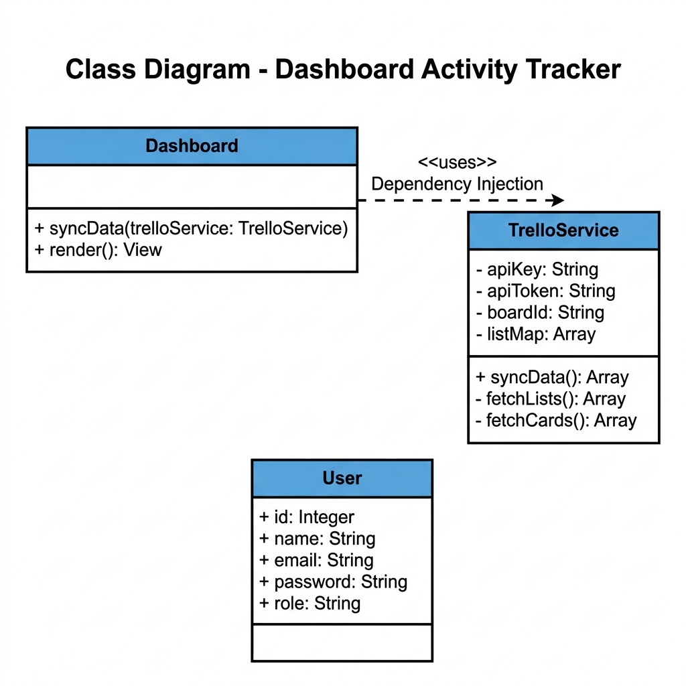

# Diagram UML: Dashboard Activity Tracker

Dokumen ini berisi pemodelan sistem menggunakan bahasa pemodelan terpadu (UML) berupa *Use Case Diagram*, *Activity Diagram*, *Sequence Diagram*, dan *Class Diagram* untuk sistem **Dashboard Activity Tracker Parthaistic Digital Agency**.

---

## 1. Use Case Diagram
Diagram Use Case menggambarkan interaksi antara pengguna (aktor) dengan sistem untuk melihat fungsionalitas yang disediakan. Terdapat dua aktor utama: **HR / Project Manager** yang memiliki akses penuh ke seluruh fitur, dan **Karyawan Remote** yang hanya dapat mengakses ringkasan progres.

| Aktor               | Use Case yang Dapat Diakses                                                                                                            |
| :------------------ | :------------------------------------------------------------------------------------------------------------------------------------- |
| HR / Project Manager | Melihat Dasbor Ringkasan, Memantau Grafik Aktivitas Harian, Melihat Progres Individu Karyawan, Memicu Sinkronisasi Data Trello API |
| Karyawan Remote      | Melihat Dasbor Ringkasan, Melihat Progres Individu Karyawan                                                                         |

---

## 2. Activity Diagram
Diagram aktivitas menjelaskan alur kerja (*workflow*) yang terjadi di dalam sistem ketika pengguna mengakses halaman dasbor dan bagaimana proses sinkronisasi Trello berjalan. Percabangan utama terjadi ketika sistem mengevaluasi apakah data cache masih valid atau perlu mengambil data baru dari Trello API.

**Keterangan Alur:**
- **Cache Valid**: Data langsung dimuat dari penyimpanan lokal tanpa melakukan *HTTP Request* ke Trello, sehingga halaman tampil sangat cepat.
- **Cache Kedaluwarsa / Kosong**: `TrelloService` menembakkan *HTTP Request* ke dua *endpoint* Trello (`/lists` dan `/cards`), memformat respons, lalu menyimpannya kembali ke *cache* untuk permintaan berikutnya.

---

## 3. Sequence Diagram
Diagram sekuensi memperlihatkan urutan komunikasi antar objek/komponen di dalam sistem berdasarkan garis waktu (*timeline*). Terdapat 5 objek partisipan: Pengguna, Dashboard View, Livewire Component, TrelloService, dan Trello REST API.

**Urutan Komunikasi:**
1. Pengguna mengakses rute `/dashboard` pada browser.
2. View memanggil fase inisialisasi (*Mount*) pada Livewire Component.
3. Livewire Component memanggil metode `syncData()` pada `TrelloService`.
4. `TrelloService` melakukan pengecekan *cache*. Jika kedaluwarsa, ia menghubungi Trello REST API untuk mengambil data *Lists* dan *Cards*.
5. Data bersih diteruskan kembali ke Livewire lalu di-*render* sebagai grafik dan tabel di layar pengguna.

---

## 4. Class Diagram
Diagram kelas menunjukkan struktur statis dari arsitektur perangkat lunak yang dirancang, mencakup kelas, atribut, metode, serta hubungan ketergantungan (*dependency*) antar kelas.

**Keterangan Relasi:**
- Kelas `Dashboard` memiliki ketergantungan (*dependency injection*) terhadap kelas `TrelloService` melalui parameternya pada metode `syncData()`.
- Kelas `TrelloService` bersifat otonom — ia mengelola seluruh komunikasi dengan API Trello secara mandiri, menyembunyikan kerumitan teknis dari komponen lain (*encapsulation*).
- Kelas `User` merepresentasikan entitas pengguna yang dapat mengakses sistem.
